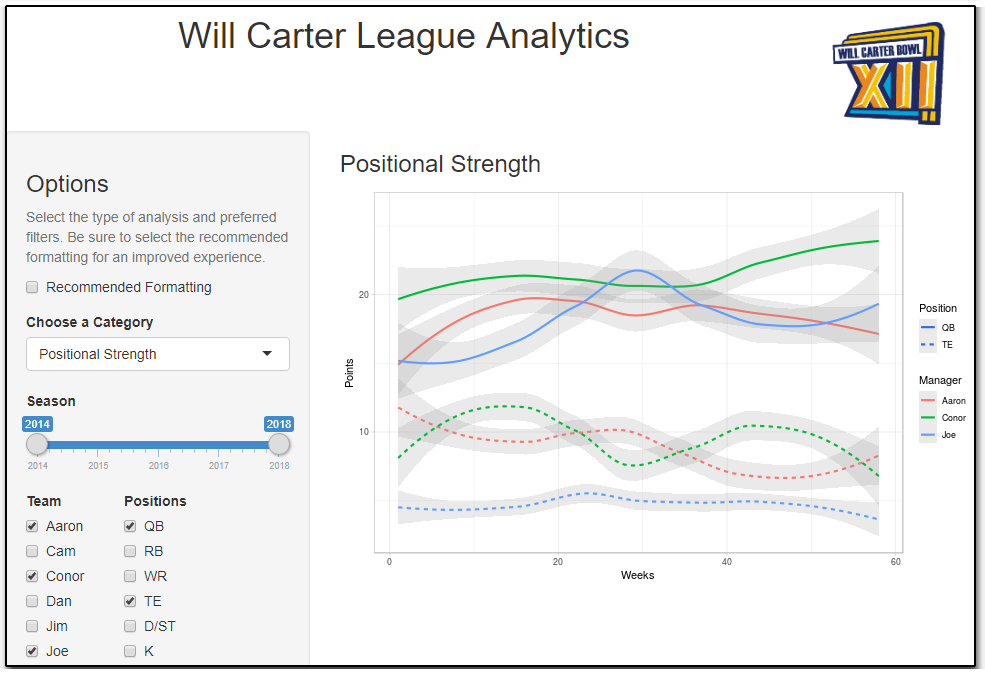

# Fantasy Football Analysis App
> Shiny web app for Fleaflicker Fantasy Football League Analytics

[Live Shiny App](https://jdegregorio.shinyapps.io/wcbowl/)

## Overview
This project repository may be used to scrape all of the necessary league data from the [Fleaflicker](www.fleaflicker.com) fantasy football league website as well as deploy a Shiny web app to run league analytics.  All that is needed to get started is the league ID, obtained by the home URL for your league.

## Features

The shiny app includes multiple interactive features/plots for diving into your leagues stats:
  * Power Rankings
  * Head-to-Head Stats
  * Point Distribution
  * Positional Strength
  * Smack Talk Easter Eggs
